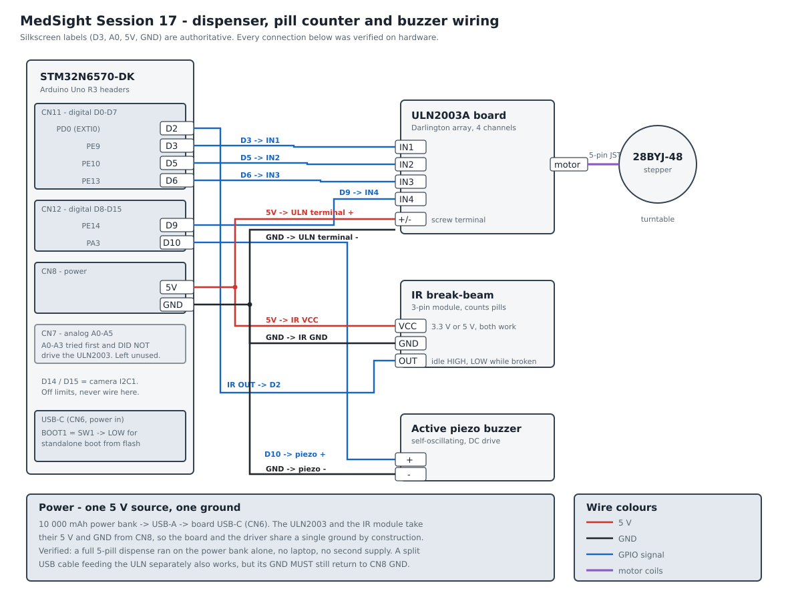

# MedSight — Hardware Wiring

**Peripherals covered:** 28BYJ-48 stepper turntable (via ULN2003A), 3-pin IR
break-beam pill counter, active piezo buzzer, and the 5 V power path.

**Status:** every connection in this document was wired and run on the real
board during Session 17. The stepper turns, the IR counter counts, the buzzer
sounds, and a complete 5-pill dispense has been performed with the board
running from a power bank alone — no laptop, no debugger, no bench supply.

Introduced in Session 17. Firmware: `FSBL/Src/dispenser.c`, `FSBL/Src/buzzer.c`.

---

## 1. The table

This is the whole wiring job. Fourteen wires.

### 1.1 Stepper driver — ULN2003A board

| From (STM32N6570-DK) | MCU pin | Header | To (ULN2003A) | Note |
|---|---|---|---|---|
| `D3`  | PE9  | CN11 | `IN1` | coil A |
| `D5`  | PE10 | CN11 | `IN2` | coil B |
| `D6`  | PE13 | CN11 | `IN3` | coil C |
| `D9`  | PE14 | CN12 | `IN4` | coil D |
| `5V`  | —    | CN8  | screw terminal `+` | see §3 |
| `GND` | —    | CN8  | screw terminal `−` | **required even if the ULN is fed separately** |

The 28BYJ-48's 5-pin JST plug goes into the white socket on the ULN2003 board.
It is keyed and only fits one way. Nothing about the motor connects to the
STM32 directly.

### 1.2 IR break-beam pill counter

| From (STM32N6570-DK) | MCU pin | Header | To (IR module) | Note |
|---|---|---|---|---|
| `D2`  | PD0 | CN11 | `OUT` | EXTI0, both edges |
| `5V`  | —   | CN8  | `VCC` | 3V3 also works — both were tested |
| `GND` | —   | CN8  | `GND` | |

`D2` is an **input**; the arrow runs from the module to the board.

### 1.3 Buzzer

| From (STM32N6570-DK) | MCU pin | Header | To (piezo) | Note |
|---|---|---|---|---|
| `D10` | PA3 | CN12 | `+` | plain push-pull GPIO |
| `GND` | —   | CN8  | `−` | |

The buzzer is an **active** piezo — it contains its own oscillator, so the
firmware only switches DC on and off. No PWM, no timer, no resistor.

### 1.4 Pins that must stay unwired

| Pin | MCU pin | Why |
|---|---|---|
| `D14` | PC1 | camera I2C1 SDA — in use |
| `D15` | PH9 | camera I2C1 SCL — in use |
| `A0`–`A3` | PA5/PA9/PA10/PA12 | see §5 |

> A buzzer or a coil that steals a pin from the camera is worse than no buzzer
> and no coil. The pin budget was traced against every live consumer before
> anything was wired.

### 1.5 Finding the pins

Wire by the **silkscreen label** printed next to each pin on the board
(`D3`, `D5`, `5V`, `GND`). That is what the table's first column gives, and
it is the only labelling that is unambiguous in front of you with a jumper in
your hand. The MCU-pin column is there so the table can be checked against
`dispenser.c` and `buzzer.c`, not for wiring.

---

## 2. Diagram



---

## 3. Power

One 5 V source, one ground.

```
10 000 mAh power bank ──USB-A──▶ board USB-C (CN6)
                                      │
                                      └── CN8 5V / GND ──▶ ULN2003 terminal
                                                        └▶ IR module VCC / GND
```

Running the ULN2003 from the board's own CN8 `5V` was tested and works
flawlessly, including under motor load. That is the recommended arrangement
because it makes a shared ground structural rather than something you have to
remember.

A split USB cable feeding the ULN2003 straight from the power bank also works
— but **its ground must still return to CN8 `GND`**. A driver whose ground
floats relative to the MCU will not switch, and the failure looks exactly like
a dead driver: no LEDs, no motion, no error.

For standalone operation set **BOOT1 (SW1) LOW** so the board boots the signed
image from external flash instead of waiting for a debugger. See
`session_17_notes.md` for how that image is built and flashed.

---

## 4. Firmware knobs

All three live in the driver sources and need no `.ioc`, no regeneration, and
no wiring change to flip.

| Macro | File | Default | What it does |
|---|---|---|---|
| `MEDSIGHT_PHYSICAL_DISPENSER` | `Inc/dispenser.h` | `1` | `0` runs the full application with **no hardware attached**, using the Session 10 simulated dispense. Both values build clean; this is not a debug path, it is a supported configuration. |
| `MS_COIL_PINSET` | `Src/dispenser.c` | `1` | `1` = digital D3/D5/D6/D9. `0` = the CN7 analog set, kept only as a record — see §5. |
| `MS_DISPENSE_DIRECTION` | `Src/dispenser.c` | `1` | `-1` reverses the turntable, for when the hopper is assembled mirrored. Flips dispense and settle together, so nothing else needs touching. |

---

## 5. Why `A0`–`A3` are not used

The first attempt drove the ULN2003 from `A0`–`A3` on CN7 (PA5/PA9/PA10/PA12).
It did not work, and it did not work in an unusually quiet way: all four pins
read back HIGH through `GPIOx->IDR`, so the MCU believed it was driving them,
while the ULN2003's own channel LEDs never lit and the motor never moved.

What settled it was a direct 3V3 touch test — jumpering the board's `3V3` pin
straight to a ULN input lit that channel's LED immediately. That single test
proved the grounds were common and the driver was healthy, which left the CN7
pins themselves as the only remaining suspect. Moving to `D3/D5/D6/D9` made
the motor turn on the first try.

The analog pin set is preserved behind `MS_COIL_PINSET 0` so the finding is
not lost, but it should be treated as known-bad on this board.

---

## 6. Bring-up checklist

Run in this order. Each step is independently observable, so a failure tells
you which of the fourteen wires to look at.

1. **Power only.** Board boots to the MedSight UI. No peripheral wired yet.
2. **Buzzer.** Wire `D10` and `GND`. Tapping the keypad should tick.
3. **IR module.** Wire `OUT`/`VCC`/`GND`. The module's own LED changes state
   when you break the beam with a finger. The line idles HIGH and pulls LOW
   while broken; real pill breaks measure **17–46 ms**, and anything under
   8 ms is discarded as contact chatter.
4. **ULN2003, no motor.** Wire `IN1`–`IN4` and power. Start a dispense — the
   four channel LEDs should chase in sequence. If they do not light at all,
   go to §5 and to the ground note in §3.
5. **Motor.** Plug in the JST. Confirm the turntable rotates in the direction
   that feeds the chute; if it is backwards, set `MS_DISPENSE_DIRECTION` to
   `-1` rather than rewiring the coils.
6. **Full dispense.** Register a patient, request a dose, watch the on-screen
   progress bar step once per counted pill.

A dispense that counts nothing for 25 seconds reports **JAM** (nothing was
released). One that counts some but not all of the requested pills and then
goes quiet for 25 seconds reports **SHORT** — the hopper needs refilling.
Neither is an error condition and neither calls `Error_Handler()`; both are
normal outcomes of a mechanical device and are recorded in the audit log with
the count that was actually delivered.

---

## 7. Bill of materials

| Item | Qty | Notes |
|---|---|---|
| STM32N6570-DK | 1 | |
| 28BYJ-48 stepper, 5 V | 1 | ships with the ULN2003 board |
| ULN2003A driver board | 1 | the common 4-LED breakout |
| 3-pin IR break-beam module | 1 | digital `OUT`, not analog |
| Active piezo buzzer | 1 | **active**, not passive |
| USB power bank, 5 V | 1 | 10 000 mAh used; 22.5 W is ample |
| USB-A to USB-C cable | 1 | |
| Female-to-female jumpers | 14 | |

No resistors, no transistors, no level shifters, no external regulator. The
ULN2003A has its own input network (2.7 kΩ series plus base-emitter pulldowns,
TI SLRS027T §7.2–7.3), so its inputs do not float and need no pull-downs of
ours.

---

## See also

- `documents/HARDWARE_ARCHITECTURE.md` — the full pin map and peripheral budget
- `documents/MECHANICAL_DESIGN.md` — the hopper, chute and turntable geometry
- `documents/milestones/session_17_notes.md` — bring-up log, measurements, and
  the standalone-boot root cause
